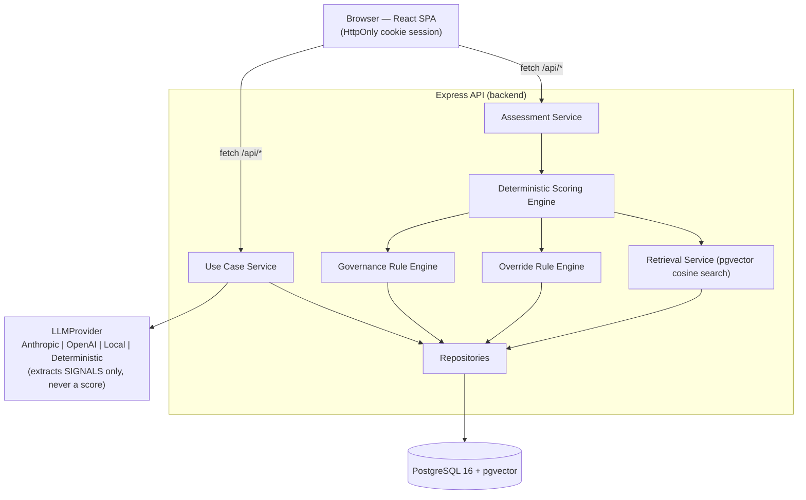

# Architecture

## System overview

The application is a monorepo with two deployables and one shared datastore:

- **backend/** — a Node.js/TypeScript/Express REST API. Owns all business logic: use-case structuring, the deterministic scoring engine, the data-driven governance rule engine, RAG-based evidence retrieval, and persistence.
- **frontend/** — a React/TypeScript/Vite single-page app. Talks to the backend exclusively over HTTP; holds no scoring logic of its own beyond rendering what the API returns.
- **PostgreSQL 16 + pgvector** — the single system of record for use cases, assessments, governance rules, sources, and vector embeddings for retrieval. One database, not a polyglot store, because the workload (structured relational data plus a modest number of embedding vectors) does not justify a second specialized system at this scale.

## The one architectural principle everything else follows

**The LLM never computes a risk score.** An LLM provider (or the deterministic NLP fallback) is used exactly once per use case, at creation time, to extract structured *signals* from free-text input (`hasFinancialData`, `primaryDomain`, `automationLevel`, `isGenerativeAI`, …). Those signals are persisted. Every subsequent step — rule evaluation, scoring, risk-level classification, override enforcement — is pure, deterministic code running against persisted data. This is why re-running an assessment (`POST /api/assessments/:id/run`) against the same use case always reproduces the same score: it replays the stored signals through the same deterministic engine rather than re-prompting a model that could answer differently each time.

This split is also why `use_cases` and `assessments` are separate resources (see [database.md](./database.md)) rather than one combined "assessment" object: structuring (LLM-touching, happens once) and scoring (deterministic, can happen many times) are genuinely different operations with different reproducibility guarantees, and collapsing them into one endpoint would hide that distinction from the API's own shape.

## Request flow: creating and scoring a use case

1. `POST /api/use-cases` — the frontend submits the use-case form. The backend calls `getLLMProvider().extractSignals(input)`, builds a `StructuredUseCase` (the canonical rule-evaluation context — booleans and enums like `hasFinancialData`, `primaryDomain`, `automationLevel`), and persists a new `use_cases` row with both `raw_signals` (what the provider returned) and `extracted_json` (the structured context) as JSONB.
2. `POST /api/assessments` (`{useCaseId}`) — loads the use case, calls `runDeterministicAssessment(input, storedSignals)`. For nine of the ten governance dimensions this: loads active `governance_rules` for that dimension from Postgres, evaluates each rule's conditions against the structured signals, sums the matching rules' `scoreDelta` values (clamped 0–5), retrieves supporting evidence via pgvector cosine search over `source_chunks`, and assembles a `DimensionAssessment`. The tenth, `REGULATORY_EXPOSURE`, is special-cased and scored entirely by a separate keyword/region mapping against specific named regulations rather than by any `governance_rules` row — see [assessment-methodology.md](assessment-methodology.md#regulatory-exposure--a-full-exception-documented-rather-than-hidden). Once all ten dimensions are scored, `applyOverrideRules` checks the eight cross-dimension `override_rules` (e.g. "high impact + low oversight → minimum High") and the assessment's classification is the maximum of the threshold-derived level and any triggered override. The full result — assessment, ten dimension rows, evidence links, recommendations — is written in one transaction.
3. `POST /api/assessments/:id/run` — re-scores the *same* use case from its already-stored `raw_signals`, without calling the LLM again. This is the reproducibility guarantee made concrete and testable (see `assessmentApi.test.ts`, which asserts `rerunRes.body.overallScore === res.body.overallScore`).

## Provider abstraction (LLM and embeddings)

Both the LLM layer and the embedding layer follow the same shape: an interface (`LLMProvider`, `EmbeddingProvider`), several implementations, and a factory that picks one from configuration and degrades to a deterministic fallback rather than failing the request.

- `LLMProvider`: `DeterministicProvider` (regex/keyword extraction, default, no key needed) | `AnthropicProvider` | `OpenAIProvider` | `LocalLLMProvider` (any OpenAI-chat-completions-compatible local server — Ollama, LM Studio, vLLM). Selected by `LLM_PROVIDER`; if the selected provider's key/URL isn't configured, or a live call fails, the app falls back to `DeterministicProvider` and the response's `extractionMethod` field says so — the degradation is visible, not silent.
- `EmbeddingProvider`: currently one implementation, `HashingEmbeddingProvider` — see [ai-and-rag.md](./ai-and-rag.md) for why, and what a real neural embedding drop-in would require.

## Multi-tenancy and auth (current state, honestly scoped)

Every business table carries `tenant_id`. Users authenticate with email/password and receive a short-lived JWT in an `HttpOnly` cookie; roles are `ADMIN`, `ASSESSOR`, `REVIEWER`, and `VIEWER`. The current POC still uses one seeded tenant for assessment repositories. The next multi-tenant hardening step is to pass the authenticated session's `tenantId` into every repository query and enforce it on all reads and writes.

## Observability

Every request gets a UUID (`req.requestId`), echoed back as the `X-Request-Id` response header and logged in structured JSON (timestamp, request id, method, path, status, duration, IP) to stdout. The same request id is persisted to an `audit_logs` row (fire-and-forget — a logging failure never fails the user's request). This is what lets an incorrect recommendation be traced end-to-end after the fact: `X-Request-Id` from a bug report maps directly to one `audit_logs` row and one line of structured stdout output.

## What is deliberately NOT in this architecture

- **No message queue / background workers.** Assessment scoring is fast (rule evaluation + a handful of pgvector queries), so it runs synchronously inside the request. Revisit if source ingestion volume or LLM latency grows enough to justify async processing.
- **No microservices.** One backend process, one database. Splitting "research/RAG" or "rule engine" into separate services would add network hops and deployment complexity with no scaling justification at this data volume (15 sources, tens of use cases).
- **No caching layer (Redis, etc.).** Postgres itself, with appropriate indexes, comfortably serves this read volume.
