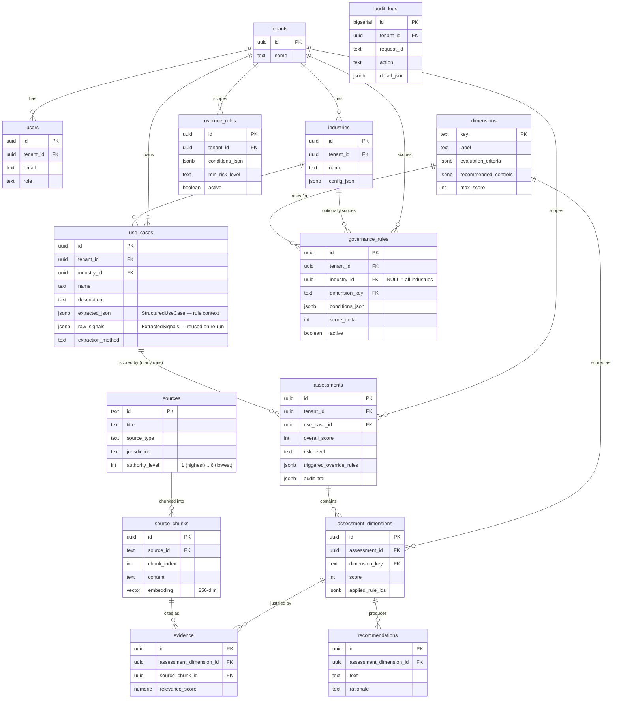

# Database

PostgreSQL 16 with the `vector` (pgvector) and `pgcrypto` extensions. Schema lives in `backend/src/database/migrations/001_init.sql`; applied with `npm run db:migrate` (a plain `psql -f` run — there is no migration framework/version table yet, which is a known limitation for a real multi-migration future, noted rather than hidden).

## Entity-relationship diagram

## Design decisions worth explaining

**`use_cases` and `assessments` are separate tables**, not one row. A use case is structured once (LLM touches it exactly once, at creation); it can then be scored many times (rule changes, periodic re-assessment, `POST /:id/run`). Modeling this as two tables with a foreign key, rather than one mutable "assessment" row, is what makes multiple scoring runs against the same use case a normal, cheap operation — and what makes `use_cases.raw_signals` the reproducibility anchor: every re-run reads that JSONB column rather than re-deriving it.

**`governance_rules` and `override_rules` are data, not code.** `conditions_json` is a small generic condition list (`[{field, op, value}, ...]`) evaluated by a generic interpreter (`services/rules/ruleEngine.ts`), not a per-dimension TypeScript function. Adding, changing, or disabling a rule is a database write. `industry_id` on `governance_rules` is nullable specifically so a rule can be "global" (`NULL`) or industry-specific — the mechanism the multi-industry requirement depends on, even though only one industry is seeded today.

**`dimensions` is a table, not a hardcoded enum-plus-object in the frontend.** The ten governance dimensions (label, description, evaluation criteria, recommended controls) are rows the `/api/methodology` endpoint reads live, so adding an eleventh dimension is a data change plus a `dimension_key` reference update in any new rules — not a frontend redeploy.

**`source_chunks.embedding` is `vector(256)`**, matching the current `HashingEmbeddingProvider`'s output dimension (see [ai-and-rag.md](./ai-and-rag.md)). Swapping in a neural embedding model later is a dimension change on this one column plus a re-embed of `sources`, not a schema redesign.

**No ANN index on `source_chunks.embedding` yet.** An `ivfflat` index needs roughly `sqrt(row_count)` lists to have non-empty clusters; with the current ~30-40 seeded chunks, an index with too many lists relative to row count left some clusters empty, and a query probing an empty cluster silently returned zero results even though a full table scan of the same rows was both correct and fast (confirmed by hand during development — this was a real bug, not a hypothetical). The index was removed rather than tuned around, with a comment in the migration explaining exactly when to re-add it (once `source_chunks` is in the thousands) and that HNSW is the better choice at that point since it degrades more gracefully at small-to-medium scale than IVFFlat.

**`evidence` and `recommendations` are separate tables per `assessment_dimensions` row**, not JSONB arrays on it. Both are 1:many, queried independently (`GET /api/assessments/:id/sources`, `GET /api/assessments/:id/findings`), and keeping them as real rows rather than embedded JSON keeps those endpoints simple `SELECT`s instead of JSONB unpacking.

**`audit_logs` is intentionally denormalized and append-only** (`detail_json` is a JSONB catch-all rather than a fixed column set) because its purpose is forensic: capture enough about an action, indexed by `request_id`, to reconstruct what happened without needing to predict every field a future action might need to log.

## Known gaps (stated plainly)

- No migration versioning/rollback tooling — one SQL file, applied idempotently-by-convention (`CREATE TABLE`, not `CREATE TABLE IF NOT EXISTS`, so re-running against an already-migrated database currently errors rather than no-ops; `db:seed` is the part that's genuinely idempotent).
- `tenant_id` is written everywhere but not yet enforced as a `WHERE` filter on every read path — see [architecture.md](./architecture.md#multi-tenancy-and-auth-current-state-honestly-scoped).
- `governance_rules.conditions_json`, `override_rules.conditions_json`, `dimensions.evaluation_criteria`, and similar JSONB columns have no CHECK constraint or JSON-schema validation at the database layer; malformed data would currently only surface at read time in the rule engine. Acceptable for a single-tenant demo seeded by one trusted script; a real multi-tenant admin UI for editing rules would need to validate on write.
